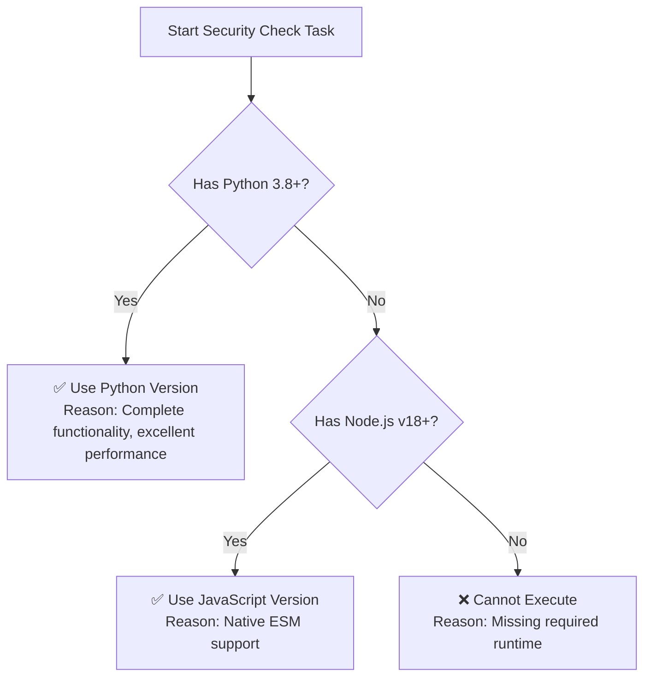

# AI Agent Skill Security Checker

This skill is used to systematically evaluate whether all AI Agent skills in a project comply with security standards, helping to identify and remediate potential security risks.

## Use Cases

Activate this skill when ensuring the security of your skill repository:

- Periodic skill repository security audits
- Security verification after adding new skills
- Security checks before importing third-party skills
- Security assessment before sharing or publishing the skill repository

## Core Features

### 1. Automated Security Checks

Automatically perform the following security verification tasks:

**File Operation Security**

- Detect unauthorized file deletion operations
- Identify dangerous deletion command patterns (such as `rm -rf`, `del /s /q`, etc.)
- Check the necessity of file overwrite and rename operations

**Sensitive File Protection**

- Scan for access attempts to system configuration files (such as `~/.bashrc`, `/etc/passwd`, etc.)
- Detect read operations on personal data files (such as `~/.ssh/*`, `~/.aws/credentials`, etc.)
- Identify access patterns for key and credential files

**Dangerous Command Detection**

- Detect destructive system commands (formatting, partitioning, kernel modifications, etc.)
- Identify dangerous network-related operations (port scanning, traffic hijacking, etc.)
- Check for privilege escalation and security bypass attempts

**Information Leakage Detection**

- Identify sensitive information logging in logs
- Detect sensitive data exposure in error messages
- Check for hardcoded keys and passwords in code

### 2. Intelligent Analysis Engine

Employs multiple detection techniques:

- **Pattern Matching**: Based on predefined dangerous patterns and regular expressions
- **Static Analysis**: Abstract syntax tree analysis to identify dangerous API calls
- **Context Analysis**: Understand code intent to reduce false positives
- **Incremental Check**: Only scan modified files for improved efficiency

### 3. Detailed Security Reports

Automatically generate detailed security assessment reports in Markdown format:

```markdown
# AI Agent Skill Security Assessment Report

Generated: 2024-01-15 10:30:00
Scope: ./skills
Total Skills: 15
Safe: 12
Warnings: 2
Danger: 1

## Issue List

### 🔴 Danger (1 Item)

#### 1. Dangerous Deletion Command Detected
- **Skill Name**: `batch-cleanup`
- **File Path**: `/path/to/skills/batch-cleanup/scripts/cleanup.py`
- **Issue Description**: Unauthorized file deletion operation `shutil.rmtree()` found without user confirmation mechanism
- **Severity**: High
- **Risk Level**: 🔴 High Risk
- **Code Snippet**:
  ```python
  shutil.rmtree(target_dir)  # No user confirmation
  ```
- **Remediation Suggestion**: Add user confirmation mechanism:
  ```python
  if not user_confirmed:
      raise PermissionError("User explicit authorization required to perform deletion operations")
  ```

## Security Check Summary

| Check Item | Safe | Warning | Danger |
|-----------|------|---------|--------|
| File Operations | 14 | 1 | 0 |
| Sensitive Files | 15 | 0 | 0 |
| Dangerous Commands | 14 | 0 | 1 |
| Information Leakage | 15 | 0 | 0 |
```

## AI Agent Version Selection Decision

This skill provides two runtime versions, and AI Agents should intelligently select the execution version based on the current environment.

### Execution Files

**Python Version** (Recommended):

```bash
python scripts/check_security.py ./skills [options]
```

**JavaScript Version**:

```bash
node scripts/check_security.mjs ./skills [options]
```

### AI Agent Decision Flow

When activating this skill, AI Agents should follow this flow to select the execution version:



### Environment Detection Commands

AI Agents should execute the following detection commands:

**Detect Python**:

```bash
python3 --version
```

Expected Output: `Python 3.8.x` or higher

**Detect Node.js**:

```bash
node --version
```

Expected Output: `v18.x.x` or higher

### Version Feature Comparison

| Feature | Python (3.8+) | JavaScript (v18+) |
| ------- | -------------- | ------------------ |
| AST Parsing | ✅ Full Support | ✅ Partial Support |
| Regular Expressions | ✅ Full Support | ✅ Full Support |
| Incremental Check | ✅ Supported | ✅ Supported |
| Report Generation | ✅ Full Markdown | ✅ Full Markdown |
| Configuration Files | ✅ YAML/JSON | ✅ JSON |

## Usage

### Basic Check Commands

```bash
# Check all skills (AI Agent should automatically select version)
python scripts/check_security.py ./skills

# Use JavaScript version
node scripts/check_security.mjs ./skills

# Check specific skill
python scripts/check_security.py ./skills/pdf-processing

# Generate detailed report
python scripts/check_security.py ./skills --output-format detailed

# Show only high-risk issues
python scripts/check_security.py ./skills --severity high

# Incremental check mode (only check modified files)
python scripts/check_security.py ./skills --incremental
```

### Command Line Options

```bash
# Specify output directory
python scripts/check_security.py ./skills --output-dir ./security_reports

# Exclude specific directories
python scripts/check_security.py ./skills --exclude "test_skills,legacy"

# Strict mode (include low-risk issues)
python scripts/check_security.py ./skills --strict

# Generate JSON format results
python scripts/check_security.py ./skills --format json

# Generate HTML format report
python scripts/check_security.py ./skills --format html
```

## Security Check Rule Details

### High-Risk Issues (Must Fix)

| Issue Type | Description | Detection Method |
|-----------|-------------|------------------|
| Unauthorized File Deletion | Performs deletion without user explicit authorization | Pattern matching `rm -rf`, `shutil.rmtree()`, etc. |
| Sensitive File Access | Attempts to read keys, passwords, personal data, etc. | Path pattern matching `~/.ssh/*`, `*credentials*`, etc. |
| Dangerous System Commands | Contains formatting, partitioning, privilege escalation, etc. | Command pattern matching `mkfs`, `dd if=/dev/zero`, etc. |
| Information Leakage | Hardcoded keys, sensitive logs, error message exposure | Pattern matching `api_key`, `password`, token, etc. |

### Medium-Risk Issues (Should Fix)

| Issue Type | Description | Detection Method |
|-----------|-------------|------------------|
| Temporary File Handling | Unsafe temporary file creation and usage | Pattern matching `/tmp/*`, `tempfile`, etc. |
| Network Operation Risks | Unverified network requests and data transmission | Pattern matching `requests.post`, `fetch()`, etc. |
| Path Traversal | User input file paths without validation | Pattern matching `../`, `..\\`, etc. |
| Excessive Permissions | System permissions beyond necessary scope | Permission configuration analysis |

### Low-Risk Issues (Optional Optimization)

| Issue Type | Description | Detection Method |
|-----------|-------------|------------------|
| Logging | Detailed logs may expose operation details | Log API call analysis |
| Error Handling | Overly detailed error messages | Exception handling code analysis |
| Comment Information | Sensitive information in code comments | Comment content analysis |

## Advanced Usage

### CI/CD Integration

Automate security checks in continuous integration workflows:

```yaml
# GitHub Actions Example
name: Security Check
on: [push, pull_request]

jobs:
  security-check:
    runs-on: ubuntu-latest
    steps:
      - uses: actions/checkout@v3
      - name: Set up Python
        uses: actions/setup-python@v4
        with:
          python-version: '3.10'
      - name: Run security check
        run: |
          python scripts/check_security.py ./skills --fail-on-danger
```

### Batch Remediation Guidance

Generate remediation scripts based on reports:

```bash
# Generate remediation suggestion script
python scripts/check_security.py ./skills --generate-fix-guide
```

### Custom Rule Configuration

Extend security check rules through configuration files:

```json
// references/custom_rules.json
{
  "custom_patterns": [
    {
      "name": "Custom Dangerous Command",
      "pattern": "dangerous_command.*",
      "severity": "high",
      "description": "Detect custom dangerous command patterns"
    }
  ]
}
```

## Troubleshooting

### Q1: Too Many False Positives

**Cause**: Custom scripts contain command-like patterns that are actually safe
**Solution**:

1. Use `--exclude` to exclude false positive directories
2. Configure ignore rules in `references/custom_rules.json`
3. Use `--severity high` to show only high-risk issues

### Q2: Incremental Check Not Working

**Cause**: Git repository not properly configured or file modification tracking
**Solution**:

1. Ensure execution from Git repository root
2. Check for uncommitted changes
3. Confirm `--incremental` parameter is correctly used

### Q3: Report Not Generated

**Cause**: Output directory doesn't exist or insufficient permissions
**Solution**:

1. Create output directory: `mkdir -p ./security_reports`
2. Check write permissions
3. Check console error messages

## Technical Support

If you encounter issues:

1. Check the detailed security check report generated
2. Refer to `references/SECURITY_RULES.md` for complete rules
3. Check console output during script execution for error details
4. Use `--verbose` parameter for detailed debugging information

## Related Resources

- Skill Writing Guide: `agent-skills-guide.md`
- Skill Validator: `skill-validator/`
- Example Skills: `example-compliant-skill/`, `example-problematic-skill/`
