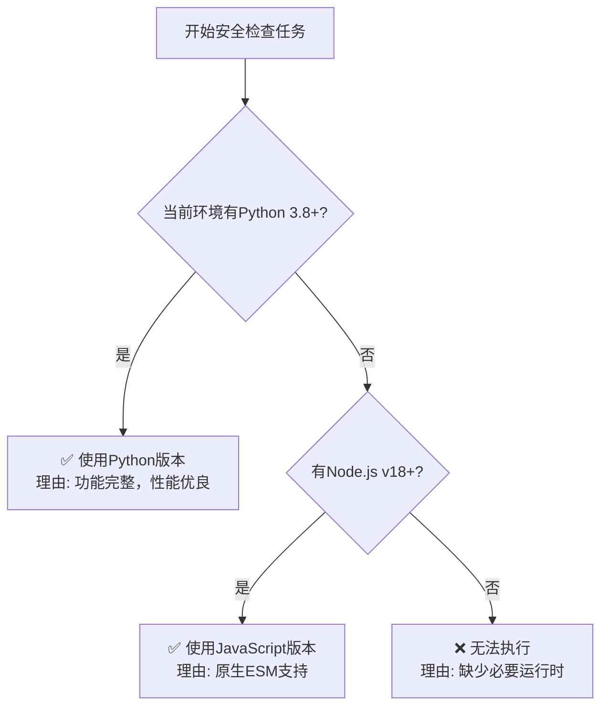

# AI Agent 技能安全检查器

本技能用于系统性评估项目中所有AI Agent技能是否符合安全规范，帮助识别和修复潜在的安全风险。

## 使用场景

当需要确保技能库的安全性时激活此技能：

- 定期技能库安全审计
- 添加新技能后的安全性验证
- 第三方技能导入前的安全检查
- 技能库共享或发布前的安全评估

## 核心功能

### 1. 自动化安全检查

自动执行以下安全验证任务：

**文件操作安全**

- 检测未授权的文件删除操作
- 识别危险的删除命令模式（如 `rm -rf`、`del /s /q` 等）
- 检查文件覆盖和重命名操作的必要性

**敏感文件保护**

- 扫描对系统配置文件的访问尝试（如 `~/.bashrc`、`/etc/passwd` 等）
- 检测个人数据文件的读取操作（如 `~/.ssh/*`、`~/.aws/credentials` 等）
- 识别密钥和凭证文件的访问模式

**危险命令识别**

- 检测破坏性系统命令（格式化、分区、内核修改等）
- 识别网络相关危险操作（端口扫描、流量劫持等）
- 检查提权和绕过安全限制的尝试

**信息泄露检测**

- 识别日志中的敏感信息记录
- 检测错误信息中的敏感数据暴露
- 检查代码中的硬编码密钥和密码

### 2. 智能分析引擎

采用多种检测技术：

- **模式匹配**：基于预定义危险模式和正则表达式
- **静态分析**：抽象语法树分析识别危险API调用
- **上下文分析**：理解代码意图，减少误报
- **增量检查**：仅扫描修改过的文件，提高效率

### 3. 详细安全报告

自动生成Markdown格式的详细安全评估报告：

```markdown
# AI Agent 技能安全评估报告

生成时间: 2024-01-15 10:30:00
检查范围: ./skills
总计技能: 15
安全: 12
警告: 2
危险: 1

## 问题清单

### 🔴 危险 (1项)

#### 1. 检测到危险删除命令
- **技能名称**: `batch-cleanup`
- **文件路径**: `/path/to/skills/batch-cleanup/scripts/cleanup.py`
- **问题描述**: 发现未授权的文件删除操作 `shutil.rmtree()` 未包含用户确认机制
- **严重程度**: 高
- **风险等级**: 🔴 高危
- **代码片段**:
  ```python
  shutil.rmtree(target_dir)  # 无用户确认
  ```
- **修复建议**: 添加用户确认机制：
  ```python
  if not user_confirmed:
      raise PermissionError("需要用户明确授权才能执行删除操作")
  ```

## 安全检查摘要

| 检查项目 | 安全 | 警告 | 危险 |
|---------|------|------|------|
| 文件操作 | 14 | 1 | 0 |
| 敏感文件 | 15 | 0 | 0 |
| 危险命令 | 14 | 0 | 1 |
| 信息泄露 | 15 | 0 | 0 |
```

## AI Agent 版本选择决策

本技能提供两个运行时版本，AI Agent应根据当前环境智能选择执行版本。

### 执行文件

**Python版本**（推荐）:

```bash
python scripts/check_security.py ./skills [选项]
```

**JavaScript版本**:

```bash
node scripts/check_security.mjs ./skills [选项]
```

### AI Agent决策流程

当激活此技能时，AI Agent应按以下流程选择执行版本：



### 环境检测命令

AI Agent应执行以下检测命令：

**检测Python**:

```bash
python3 --version
```

期望输出: `Python 3.8.x` 或更高版本

**检测Node.js**:

```bash
node --version
```

期望输出: `v18.x.x` 或更高版本

### 版本特性对比

| 特性 | Python (3.8+) | JavaScript (v18+) |
| ---- | -------------- | ----------------- |
| 语法树解析 | ✅ 完整支持 | ✅ 部分支持 |
| 正则表达式 | ✅ 完整支持 | ✅ 完整支持 |
| 增量检查 | ✅ 支持 | ✅ 支持 |
| 报告生成 | ✅ 完整Markdown | ✅ 完整Markdown |
| 配置文件 | ✅ YAML/JSON | ✅ JSON |

## 使用方法

### 基本检查命令

```bash
# 检查所有技能（AI Agent应自动选择版本）
python scripts/check_security.py ./skills

# 使用JavaScript版本
node scripts/check_security.mjs ./skills

# 检查指定技能
python scripts/check_security.py ./skills/pdf-processing

# 生成详细报告
python scripts/check_security.py ./skills --output-format detailed

# 仅显示高危问题
python scripts/check_security.py ./skills --severity high

# 增量检查模式（仅检查修改过的文件）
python scripts/check_security.py ./skills --incremental
```

### 命令行选项

```bash
# 指定输出目录
python scripts/check_security.py ./skills --output-dir ./security_reports

# 排除特定目录
python scripts/check_security.py ./skills --exclude "test_skills,legacy"

# 严格模式（包含低风险问题）
python scripts/check_security.py ./skills --strict

# 生成JSON格式结果
python scripts/check_security.py ./skills --format json

# 生成HTML格式报告
python scripts/check_security.py ./skills --format html
```

## 安全检查规则详解

### 高危问题（必须修复）

| 问题类型 | 说明 | 检测方法 |
|---------|------|---------|
| 未授权文件删除 | 执行删除操作前未获得用户明确授权 | 模式匹配 `rm -rf`, `shutil.rmtree()` 等 |
| 敏感文件访问 | 尝试读取密钥、密码、个人数据等文件 | 路径模式匹配 `~/.ssh/*`, `*credentials*` 等 |
| 危险系统命令 | 包含格式化、分区、提权等危险命令 | 命令模式匹配 `mkfs`, `dd if=/dev/zero` 等 |
| 信息泄露 | 硬编码密钥、敏感日志、错误信息暴露 | 模式匹配 `api_key`, `password`, token等 |

### 中风险问题（建议修复）

| 问题类型 | 说明 | 检测方法 |
|---------|------|---------|
| 临时文件处理 | 不安全的临时文件创建和使用 | 模式匹配 `/tmp/*`, `tempfile` 等 |
| 网络操作风险 | 未经验证的网络请求和数据传输 | 模式匹配 `requests.post`, `fetch()` 等 |
| 路径遍历 | 未验证的用户输入文件路径 | 模式匹配 `../`, `..\\` 等 |
| 权限过大 | 超出必要范围的系统权限请求 | 权限配置分析 |

### 低风险问题（可选优化）

| 问题类型 | 说明 | 检测方法 |
|---------|------|---------|
| 日志记录 | 详细的日志可能暴露操作细节 | 日志API调用分析 |
| 错误处理 | 过详细的错误信息 | 异常处理代码分析 |
| 注释信息 | 代码注释中包含敏感信息 | 注释内容分析 |

## 高级用法

### CI/CD集成

在持续集成流程中自动进行安全检查：

```yaml
# GitHub Actions 示例
name: Security Check
on: [push, pull_request]

jobs:
  security-check:
    runs-on: ubuntu-latest
    steps:
      - uses: actions/checkout@v3
      - name: Set up Python
        uses: actions/setup-python@v4
        with:
          python-version: '3.10'
      - name: Run security check
        run: |
          python scripts/check_security.py ./skills --fail-on-danger
```

### 批量修复指导

根据报告生成修复脚本：

```bash
# 生成修复建议脚本
python scripts/check_security.py ./skills --generate-fix-guide
```

### 自定义规则配置

通过配置文件扩展安全检查规则：

```json
// references/custom_rules.json
{
  "custom_patterns": [
    {
      "name": "自定义危险命令",
      "pattern": "dangerous_command.*",
      "severity": "high",
      "description": "检测自定义危险命令模式"
    }
  ]
}
```

## 常见问题排查

### Q1: 报告误报过多

**原因**: 自定义脚本包含类似危险命令但实际安全的操作
**解决**:

1. 使用 `--exclude` 排除误报目录
2. 在 `references/custom_rules.json` 中配置忽略规则
3. 使用 `--severity high` 仅显示高危问题

### Q2: 增量检查不生效

**原因**: 未正确配置Git仓库或文件修改追踪
**解决**:

1. 确保在Git仓库根目录执行
2. 检查是否有未提交的更改
3. 确认 `--incremental` 参数已正确使用

### Q3: 报告未生成

**原因**: 输出目录不存在或权限不足
**解决**:

1. 创建输出目录：`mkdir -p ./security_reports`
2. 检查写入权限
3. 查看控制台错误信息

## 技术支持

如遇到问题，请：

1. 检查生成的安全检查详细报告
2. 参考 `references/SECURITY_RULES.md` 完整规则
3. 查看脚本运行时的控制台输出获取错误详情
4. 使用 `--verbose` 参数获取详细调试信息

## 相关资源

- 技能编写指南：`agent-skills-guide.md`
- 技能验证器：`skill-validator/`
- 示例技能：`example-compliant-skill/`、`example-problematic-skill/`
