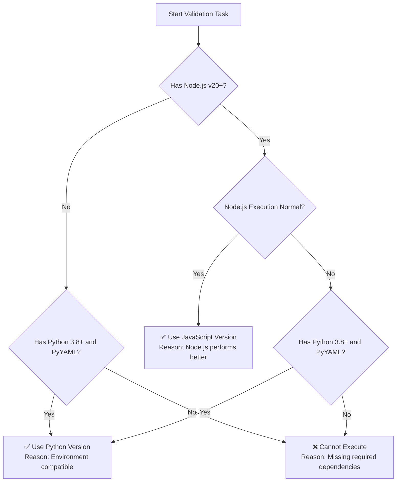

# AI Agent Skill Specification Validator

This skill is used to automatically validate that all AI Agent skills in a project comply with officially established writing standards.

## Usage Scenarios

Activate this skill when you need to ensure all skills in the skills library meet standards:

- Periodic skills library quality checks
- Compliance verification after adding new skills
- Batch fixing of skill specification issues
- Standardization checks before skills library migration or sharing

## Core Features

### 1. Automated Validation Checks

Automatically perform the following validation tasks:

**Directory Structure Validation**

- Check if each skill contains the required `SKILL.md` file
- Validate if skill directory names comply with naming conventions (lowercase letters, numbers, hyphens)
- Check reasonableness of optional directories (scripts/, references/, assets/)
- Validate relative path format for file references

**YAML Frontmatter Validation**

- Validate required `name` field:
  - Length compliance with 1-64 character requirement
  - Only lowercase letters, numbers, and hyphens allowed
  - Does not start or end with hyphen
  - No consecutive hyphens
  - Matches directory name
- Validate required `description` field:
  - Length compliance with 1-1024 character requirement
  - Provides sufficiently detailed functionality description
  - Contains usage scenario keywords
- Validate optional fields:
  - `license` field format (1-256 characters)
  - `compatibility` field length (1-500 characters)
  - `metadata` field as valid mapping

**Markdown Content Validation**

- Check for Markdown content existence
- Evaluate content structure clarity
- Validate correctness of example code and references

### 2. Issue Report Generation

Automatically generate detailed issue reports in Markdown format with the following fields:

- **Skill Name**: Identifies the skill with issues
- **Issue File Path**: Precisely locates the problem file
- **Specific Issue Description**: Detailed explanation of violated specification clauses
- **Issue Severity**: High/Medium/Low classification
- **Detailed Fix Suggestions**: Specific fix steps and code examples

### 3. Interactive Fix Assistance

Based on validation results, provide:

- Step-by-step fix guidance
- Code correction templates
- Quick links to relevant specifications
- Batch fix options

## AI Agent Version Selection Decision

This skill provides two runtime versions, and AI Agents should intelligently select the execution version based on the current environment.

### Execution Files

**Python Version** (requires PyYAML):

```bash
python scripts/validate_skills.py ./skills [options]
```

**JavaScript Version** (requires Node.js v20+):

```bash
node scripts/validate_skills.mjs ./skills [options]
```

### AI Agent Decision Process

When activating this skill, AI Agents should follow this process to select the execution version:



### Version Selection Decision Tree

1. **Primary**: Node.js v20+ (ESM mode)
   - Higher execution efficiency
   - Native ESM module support
   - No additional dependency installation required

2. **Alternative**: Python 3.8+ with PyYAML
   - Wide runtime compatibility
   - Suitable for environments without Node.js
   - Requires advance installation: `pip install pyyaml`

3. **Fallback Strategy**:
   - When primary version attempt fails, automatically switch to alternative version
   - Check if alternative version dependencies are available before switching

### Environment Detection Commands

AI Agents should execute the following detection commands:

**Detect Node.js**:

```bash
node --version
```

Expected output: `v20.x.x` or higher

**Detect Python and PyYAML**:

```bash
python3 -c "import yaml; print(yaml.__version__)"
```

Expected output: PyYAML version number (e.g., `6.0.1`)

### Version Priority Rules

| Priority | Condition | Selected Version | Description |
| -------- | --------- | ---------------- | ----------- |
| 1 | Node.js v20+ available | JavaScript | Optimal performance, no additional dependencies |
| 2 | Python 3.8+ & PyYAML available | Python | Universal compatibility solution |
| 3 | Neither satisfied | Error | Prompt user to install dependencies |

### Performance Comparison Reference

| Metric | Node.js (v20+) | Python (3.8+) |
| ------ | -------------- | ------------- |
| Startup speed | ~50ms | ~100-200ms |
| Large file parsing | Faster | Slightly slower |
| Memory usage | Lower | Slightly higher |
| Dependency count | 0 | 1 (PyYAML) |

### Common Execution Patterns

**Pattern 1: Node.js Environment (Recommended)**

```bash
# Use JS version directly
node scripts/validate_skills.mjs ./skills --output-format markdown
```

**Pattern 2: Python Environment**

```bash
# Use Python version
python scripts/validate_skills.py ./skills --output-format markdown
```

**Pattern 3: Mixed Environment Auto-Selection**

```bash
# AI Agent intelligently selects version
if command -v node &> /dev/null && [[ $(node -v) =~ ^v[0-9]+ ]] && [[ $(node -v) =~ v([0-9]+) ]] && (( ${BASH_REMATCH[1]} >= 20 )); then
    node scripts/validate_skills.mjs ./skills "$@"
else
    python scripts/validate_skills.py ./skills "$@"
fi
```

**Pattern 4: CI/CD Environment**

```bash
# GitHub Actions Example
- name: Validate skills
  run: |
    if command -v node &> /dev/null && node -v | grep -q "v[2-9][0-9]"; then
      echo "Using Node.js version"
      node scripts/validate_skills.mjs ./skills --fail-on-error
    elif command -v python3 &> /dev/null; then
      echo "Using Python version"
      pip install pyyaml
      python scripts/validate_skills.py ./skills --fail-on-error
    else
      echo "No suitable runtime available"
      exit 1
    fi
```

### Error Handling

If the primary version execution fails, AI Agents should:

1. **Log error information**
2. **Check failure reason**
3. **Try alternative version**
4. **Report final result**

## Usage

### Basic Validation Commands

```bash
# Validate all skills (AI Agent should auto-select version)
python scripts/validate_skills.py ./skills

# Use JavaScript version
node scripts/validate_skills.mjs ./skills

# Validate specific skill
python scripts/validate_skills.py ./skills/pdf-processing

# Generate detailed report
python scripts/validate_skills.py ./skills --output-format detailed

# Strict mode (includes all warnings)
python scripts/validate_skills.py ./skills --strict

# Interactive fix mode
python scripts/validate_skills.py ./skills --interactive
```

### Sample Validation Report

```markdown
# AI Agent Skill Specification Validation Report

Generated: 2024-01-15 10:30:00
Validation scope: ./skills
Total skills: 15
Passed: 12
Warnings: 3
Errors: 2

## Issue List

### ❌ Errors (2 items)

#### 1. Skill name does not comply with specifications
- **Skill name**: `mySkill`
- **File path**: `/path/to/skills/mySkill/SKILL.md`
- **Issue description**: Skill directory name does not match name field value, and name field contains uppercase letters
- **Severity**: High
- **Fix suggestion**: 
  - Change directory name to `my-skill`
  - Change name field to `my-skill`
  - YAML frontmatter should be:
    ```yaml
    name: my-skill
    description: Detailed skill description...
    ```

#### 2. Missing required description field
- **Skill name**: `test-skill`
- **File path**: `/path/to/skills/test-skill/SKILL.md`
- **Issue description**: Missing required description field in YAML frontmatter
- **Severity**: High
- **Fix suggestion**: Add description field:
  ```yaml
  ---
  name: test-skill
  description: This skill is used for [specific function]. Used when users need [usage scenario].
  ---
  ```

### ⚠️ Warnings (3 items)

#### 1. Description field too brief

- **Skill name**: `pdf-processing`
- **File path**: `/path/to/skills/pdf-processing/SKILL.md`
- **Issue description**: Description field is only 23 characters, recommend expanding to at least 50 characters for clearer functionality description
- **Severity**: Medium
- **Fix suggestion**: Expand description to:

  ```yaml
  description: Extracts text and tables from PDF files, supports form filling and document merging. Usage scenarios include: processing PDF documents, automating form filling, merging multiple PDFs, etc.
  ```

## Validation Statistics

| Validation Item | Passed | Warnings | Errors |
| --------------- | ------ | -------- | ------ |
| Directory structure | 15 | 0 | 0 |
| Name specifications | 14 | 1 | 0 |
| Description completeness | 13 | 2 | 0 |
| File format | 15 | 0 | 0 |

```

### Interactive Fix Mode

Use interactive mode for step-by-step guidance:

```bash
python scripts/validate_skills.py ./skills --interactive
```

Interactive mode features:

- Display validation issues one by one
- Provide fix options for selection
- Automatically apply selected fix solutions
- Real-time display of fix progress

## Validation Rules Details

### Directory Structure Rules

Each skill must follow this structure:

```
skill-name/
├── SKILL.md              # Required file
├── scripts/              # Optional directory
│   └── *.py/*.sh/*.js   # Executable scripts
├── references/          # Optional directory
│   ├── REFERENCE.md     # Technical reference document
│   └── FORMS.md         # Form templates
└── assets/              # Optional directory
    ├── templates/       # Template files
    └── *.png/*.jpg      # Image resources
```

### Naming Convention Rules

**Skill Name (name)**:

- ✅ Correct: `pdf-processing`, `data-analysis-v2`, `test123`
- ❌ Incorrect: `PDF-Processing` (contains uppercase), `-pdf` (starts with hyphen), `pdf--processing` (consecutive hyphens)

**Directory Name**:

- Must exactly match the `name` field value
- Only lowercase letters, numbers, and hyphens allowed
- Cannot start or end with hyphen
- Consecutive hyphens prohibited

### Content Quality Rules

**description field quality standards**:

- Must include functionality description (what it does)
- Must explain usage scenarios (when to use)
- Should include keywords (helps skill discovery)

Example structure:

```yaml
description: |
  [Primary functionality description].
  Usage scenarios include: [scenario 1], [scenario 2], [scenario 3].
  Use this skill when users mention [keyword 1], [keyword 2].
```

## Advanced Usage

### CI/CD Integration

Automatically validate in continuous integration pipeline:

```yaml
# GitHub Actions Example
name: Validate Skills
on: [push, pull_request]

jobs:
  validate:
    runs-on: ubuntu-latest
    steps:
      - uses: actions/checkout@v3
      - name: Set up Python
        uses: actions/setup-python@v4
        with:
          python-version: '3.10'
      - name: Install dependencies
        run: pip install pyyaml
      - name: Validate skills
        run: python scripts/validate_skills.py ./skills --fail-on-error
```

### Batch Fix Script Generation

Generate batch fix script:

```bash
python scripts/validate_skills.py ./skills --generate-fix-script
```

Generated script can automatically fix common issues:

- Directory name standardization
- YAML format corrections
- Missing field additions

## Troubleshooting

### Q1: Validation report shows "Directory name does not match name field"

**Cause**: The `name` field value in SKILL.md does not match the actual directory name
**Solution**:

1. Confirm the correct skill name
2. Either rename the directory to match the name field, or
3. Modify the name field to match the directory name

### Q2: "Name field contains illegal characters" error

**Cause**: Name field contains uppercase letters, spaces, or other special characters
**Solution**:

1. Convert to lowercase letters
2. Replace spaces with hyphens
3. Remove non-alphanumeric characters

### Q3: Validator reports "Description field too short"

**Cause**: Description content is insufficient to clearly describe the skill functionality
**Solution**:

1. Add main functionality description of the skill
2. Add 2-3 specific usage scenarios
3. Include relevant keywords

## Technical Support

If you encounter issues, please:

1. Check the detailed validation report generated
2. Reference `references/VALIDATION_RULES.md` for complete specifications
3. View console output during script execution for error details

## Related Resources

- Official specification document: <https://agentskills.io/specification>
- Validation rules details: `references/VALIDATION_RULES.md`
- Example skill templates: `references/EXAMPLE_SKILLS.md`
