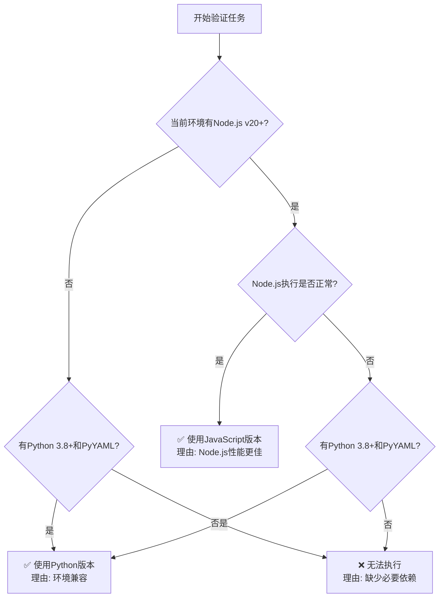

# AI Agent 技能规范验证器

本技能用于自动验证项目中所有AI Agent技能是否符合官方制定的编写规范。

## 使用场景

当需要确保技能库中的所有技能都符合标准时激活此技能：

- 定期技能库质量检查
- 添加新技能后的合规性验证
- 批量修复技能规范问题
- 技能库迁移或共享前的标准化检查

## 核心功能

### 1. 自动化验证检查

自动执行以下验证任务：

**目录结构验证**

- 检查每个技能是否包含必需的 `SKILL.md` 文件
- 验证技能目录名称是否符合命名规范（小写字母、数字、连字符）
- 检查可选目录（scripts/、references/、assets/）的合理性
- 验证文件引用的相对路径格式

**YAML前置元数据验证**

- 验证必需的 `name` 字段：
  - 长度是否符合1-64字符要求
  - 是否仅包含小写字母、数字和连字符
  - 是否以连字符开头或结尾
  - 是否包含连续连字符
  - 是否与目录名称匹配
- 验证必需的 `description` 字段：
  - 长度是否符合1-1024字符要求
  - 是否提供了足够详细的功能说明
  - 是否包含使用场景关键词
- 验证可选字段：
  - `license` 字段格式（1-256字符）
  - `compatibility` 字段长度（1-500字符）
  - `metadata` 字段是否为有效映射

**Markdown内容验证**

- 检查是否存在Markdown内容
- 评估内容结构是否清晰
- 验证示例代码和引用的正确性

### 2. 问题报告生成

自动生成Markdown格式的详细问题报告，包含以下字段：

- **技能名称**：标识出现问题的技能
- **问题所在文件路径**：精确定位问题文件位置
- **具体问题描述**：详细说明违反的规范条款
- **问题严重程度**：高/中/低三级分类
- **详细修复建议**：具体的修复步骤和代码示例

### 3. 交互式修复协助

根据验证结果提供：

- 分步骤的修复指导
- 代码修正模板
- 相关规范的快速链接
- 批量修复选项

## AI Agent 版本选择决策

本技能提供两个运行时版本，AI Agent应根据当前环境智能选择执行版本。

### 执行文件

**Python版本**（需要PyYAML）:

```bash
python scripts/validate_skills.py ./skills [选项]
```

**JavaScript版本**（需要Node.js v20+）:

```bash
node scripts/validate_skills.mjs ./skills [选项]
```

### AI Agent决策流程

当激活此技能时，AI Agent应按以下流程选择执行版本：



### 版本选择决策树

1. **首选**: Node.js v20+ (ESM模式)
   - 执行效率更高
   - 原生ESM模块支持
   - 无需额外依赖安装

2. **备选**: Python 3.8+ with PyYAML
   - 广泛的运行时兼容性
   - 适合没有Node.js的环境
   - 需要提前安装: `pip install pyyaml`

3. **回退策略**:
   - 尝试首选版本失败时，自动切换到备选版本
   - 切换前应检查备选版本依赖是否可用

### 环境检测命令

AI Agent应执行以下检测命令：

**检测Node.js**:

```bash
node --version
```

期望输出: `v20.x.x` 或更高版本

**检测Python和PyYAML**:

```bash
python3 -c "import yaml; print(yaml.__version__)"
```

期望输出: PyYAML版本号（如 `6.0.1`）

### 版本优先级规则

| 优先级 | 条件 | 选择版本 | 说明 |
| ------ | ---- | -------- | ---- |
| 1 | Node.js v20+ 可用 | JavaScript | 性能最优，无需额外依赖 |
| 2 | Python 3.8+ & PyYAML 可用 | Python | 通用兼容方案 |
| 3 | 都不满足 | 报错 | 提示用户安装依赖 |

### 性能对比参考

| 指标 | Node.js (v20+) | Python (3.8+) |
| ---- | -------------- | ------------- |
| 启动速度 | ~50ms | ~100-200ms |
| 解析大文件 | 更快 | 稍慢 |
| 内存占用 | 较低 | 略高 |
| 依赖数量 | 0 | 1 (PyYAML) |

### 常见执行模式

**模式1: Node.js环境（推荐）**

```bash
# 直接使用JS版本
node scripts/validate_skills.mjs ./skills --output-format markdown
```

**模式2: Python环境**

```bash
# 使用Python版本
python scripts/validate_skills.py ./skills --output-format markdown
```

**模式3: 混合环境自动选择**

```bash
# AI Agent智能选择版本
if command -v node &> /dev/null && [[ $(node -v) =~ ^v[0-9]+ ]] && [[ $(node -v) =~ v([0-9]+) ]] && (( ${BASH_REMATCH[1]} >= 20 )); then
    node scripts/validate_skills.mjs ./skills "$@"
else
    python scripts/validate_skills.py ./skills "$@"
fi
```

**模式4: CI/CD环境**

```bash
# GitHub Actions 示例
- name: Validate skills
  run: |
    if command -v node &> /dev/null && node -v | grep -q "v[2-9][0-9]"; then
      echo "Using Node.js version"
      node scripts/validate_skills.mjs ./skills --fail-on-error
    elif command -v python3 &> /dev/null; then
      echo "Using Python version"
      pip install pyyaml
      python scripts/validate_skills.py ./skills --fail-on-error
    else
      echo "No suitable runtime available"
      exit 1
    fi
```

### 错误处理

如果首选版本执行失败，AI Agent应：

1. **记录错误信息**
2. **检查失败原因**
3. **尝试备用版本**
4. **报告最终结果**

## 使用方法

### 基本验证命令

```bash
# 验证所有技能（AI Agent应自动选择版本）
python scripts/validate_skills.py ./skills

# 使用JavaScript版本
node scripts/validate_skills.mjs ./skills

# 验证指定技能
python scripts/validate_skills.py ./skills/pdf-processing

# 生成详细报告
python scripts/validate_skills.py ./skills --output-format detailed

# 严格模式（包含所有警告）
python scripts/validate_skills.py ./skills --strict

# 交互式修复模式
python scripts/validate_skills.py ./skills --interactive
```

```markdown
# AI Agent 技能规范验证报告

生成时间: 2024-01-15 10:30:00
验证范围: ./skills
总计技能: 15
通过: 12
警告: 3
错误: 2

## 问题清单

### ❌ 错误 (2项)

#### 1. 技能名称不符合规范
- **技能名称**: `mySkill`
- **文件路径**: `/path/to/skills/mySkill/SKILL.md`
- **问题描述**: 技能目录名称与name字段值不匹配，且name字段包含大写字母
- **严重程度**: 高
- **修复建议**: 
  - 将目录名称改为 `my-skill`
  - 将name字段改为 `my-skill`
  - YAML前置元数据应改为：
    ```yaml
    name: my-skill
    description: 技能的详细描述...
    ```

#### 2. 缺少必需的description字段
- **技能名称**: `test-skill`
- **文件路径**: `/path/to/skills/test-skill/SKILL.md`
- **问题描述**: YAML前置元数据中缺少必需的description字段
- **严重程度**: 高
- **修复建议**: 添加description字段：
  ```yaml
  ---
  name: test-skill
  description: 本技能用于[具体功能]。当用户需要[使用场景]时使用。
  ---
  ```

### ⚠️ 警告 (3项)

#### 1. description字段过于简略

- **技能名称**: `pdf-processing`
- **文件路径**: `/path/to/skills/pdf-processing/SKILL.md`
- **问题描述**: description字段仅23字符，建议扩展至至少50字符以提供更清晰的功能说明
- **严重程度**: 中
- **修复建议**: 将description扩展为：

  ```yaml
  description: 从PDF文件中提取文本和表格，支持表单填写和文档合并。使用场景包括：处理PDF文档、自动化表单填写、多PDF合并等。
  ```

## 验证统计

| 验证项目 | 通过 | 警告 | 错误 |
|---------|------|------|------|
| 目录结构 | 15 | 0 | 0 |
| 名称规范 | 14 | 1 | 0 |
| 描述完整性 | 13 | 2 | 0 |
| 文件格式 | 15 | 0 | 0 |

```

### 交互式修复模式

使用交互式模式获取逐步指导：

```bash
python scripts/validate_skills.py ./skills --interactive
```

交互模式功能：

- 逐个展示验证问题
- 提供修复选项供选择
- 自动应用选定的修复方案
- 实时显示修复进度

## 验证规则详解

### 目录结构规则

每个技能必须遵循以下结构：

```
skill-name/
├── SKILL.md              # 必需文件
├── scripts/              # 可选目录
│   └── *.py/*.sh/*.js   # 可执行脚本
├── references/          # 可选目录
│   ├── REFERENCE.md     # 技术参考文档
│   └── FORMS.md         # 表单模板
└── assets/              # 可选目录
    ├── templates/       # 模板文件
    └── *.png/*.jpg      # 图片资源
```

### 命名规范规则

**技能名称 (name)**：

- ✅ 正确：`pdf-processing`、`data-analysis-v2`、`test123`
- ❌ 错误：`PDF-Processing`（包含大写）、`-pdf`（以连字符开头）、`pdf--processing`（连续连字符）

**目录名称**：

- 必须与name字段值完全一致
- 仅允许小写字母、数字和连字符
- 不能以连字符开头或结尾
- 禁止连续连字符

### 内容质量规则

**description字段质量标准**：

- 必须包含功能描述（做什么）
- 必须说明使用场景（何时用）
- 建议包含关键词（帮助技能发现）

示例结构：

```yaml
description: |
  [主要功能描述]。
  使用场景包括：[场景1]、[场景2]、[场景3]。
  当用户提及[关键词1]、[关键词2]时使用本技能。
```

## 高级用法

### CI/CD集成

在持续集成流程中自动验证：

```yaml
# GitHub Actions 示例
name: Validate Skills
on: [push, pull_request]

jobs:
  validate:
    runs-on: ubuntu-latest
    steps:
      - uses: actions/checkout@v3
      - name: Set up Python
        uses: actions/setup-python@v4
        with:
          python-version: '3.10'
      - name: Install dependencies
        run: pip install pyyaml
      - name: Validate skills
        run: python scripts/validate_skills.py ./skills --fail-on-error
```

### 批量修复脚本

生成批量修复脚本：

```bash
python scripts/validate_skills.py ./skills --generate-fix-script
```

生成脚本可自动修复常见问题：

- 目录名称标准化
- YAML格式修正
- 缺失字段补充

## 常见问题排查

### Q1: 验证报告提示"目录名称与name字段不匹配"

**原因**: SKILL.md中的name字段值与实际目录名称不一致
**解决**:

1. 确认正确的技能名称
2. 将目录重命名为name字段值，或
3. 修改name字段以匹配目录名称

### Q2: "name字段包含非法字符"错误

**原因**: name字段包含大写字母、空格或其他特殊字符
**解决**:

1. 转换为小写字母
2. 空格替换为连字符
3. 移除非字母数字字符

### Q3: 验证器提示"description字段过短"

**原因**: description内容不足以清晰描述技能功能
**解决**:

1. 补充技能的主要功能说明
2. 添加2-3个具体使用场景
3. 包含相关的关键词

## 技术支持

如遇到问题，请：

1. 检查生成的详细验证报告
2. 参考 `references/VALIDATION_RULES.md` 完整规范
3. 查看脚本运行时的控制台输出获取错误详情

## 相关资源

- 官方规范文档：<https://agentskills.io/specification>
- 验证规则详解：`references/VALIDATION_RULES.md`
- 示例技能模板：`references/EXAMPLE_SKILLS.md`
